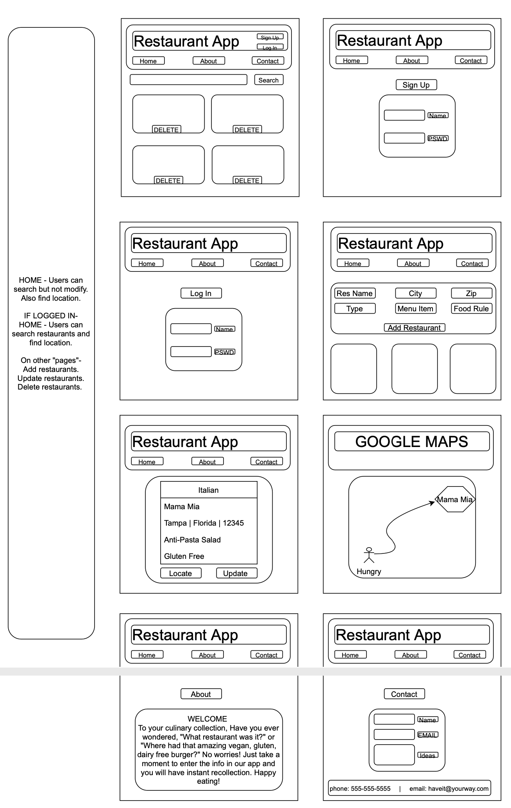

# Remember Eats - https://remembereats.herokuapp.com/

This is a full CRUD app that allows anyone to save and collect memorable restaurants and dishes that they have had in the past. It also aids those who have any food allergies or preferences so that they can recall and return to the places that they know work for their lifestyle.

## Technologies Used

VS Code Editor
GitHub
Heroku

### FRONT END

React
React Router
Bootstrap

### BACK END

Node.js
Mongoose
Express

## WireFrame

The wireframe was helpful to get an idea of the design direction that the app would take. As with all good design the final result of the App has been tweaked for a better visual quality.

## Lessons

The prep work to layout an app or program is critical to its success. Although design or even naming convention changes happen, it is a part of the process and is key to producing a quality final product or program.